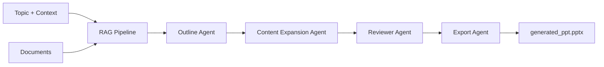

# 🤖 AI PowerPoint Generator - Multi-Agent System

[](https://www.python.org/downloads/)
[](https://fastapi.tiangolo.com/)
[](https://streamlit.io/)
[](https://openai.com/)

> Transform your documents into professional PowerPoint presentations using AI-powered multi-agent orchestration, RAG (Retrieval-Augmented Generation), and LangGraph workflows.

## ✨ Features

- 🤖 **Multi-Agent Architecture** - Specialized agents for outline, content expansion, review, and export
- 📚 **RAG Pipeline** - Context-aware content generation from uploaded documents (PDF, DOCX, TXT)
- 🔄 **LangGraph Orchestration** - Structured workflow with state management
- 🌐 **Dual Interface** - Streamlit web UI + FastAPI REST API
- 🎯 **Smart Content Generation** - AI-powered slide creation with citations
- 💾 **FAISS Vector Store** - Efficient document retrieval and semantic search
- 📊 **Professional Output** - Polished PowerPoint presentations ready to use

## 🏗️ Architecture

### Multi-Agent Workflow



### Agent Responsibilities

| Agent                 | Purpose                         | Output                       |
| --------------------- | ------------------------------- | ---------------------------- |
| **Outline Generator** | Creates structured slide layout | Slide titles & bullet points |
| **Content Expander**  | Enriches content using RAG      | Detailed slide content       |
| **Reviewer**          | Validates accuracy & quality    | Quality-checked content      |
| **Exporter**          | Generates PowerPoint file       | `.pptx` file                 |

## 🚀 Quick Start

### Prerequisites

```bash
- Python 3.8+
- OpenAI API Key
- 4GB RAM minimum
```

### Installation

1. **Clone the repository**

```bash
git clone https://github.com/Kushagra3355/contextual_ai_ppt_multiagent_system.git
cd contextual_ai_ppt_multiagent_system
```

2. **Create virtual environment**

```bash
python -m venv venv
# Windows
venv\Scripts\activate
# macOS/Linux
source venv/bin/activate
```

3. **Install dependencies**

```bash
pip install -r requirements.txt
```

4. **Configure environment**

Create `.env` file in project root:

```env
OPENAI_API_KEY=your-openai-api-key-here
MODEL_NAME=gpt-4o-mini
EMBED_MODEL_NAME=text-embedding-3-small
TEMPERATURE=0
DIMENSIONS=512
CHUNK_SIZE=1000
```

## 💻 Usage

### Option 1: Streamlit Web App

Launch the interactive web interface:

```bash
streamlit run streamlit_frontend.py
```

**Access at:** `http://localhost:8501`

#### Features:

- ✅ Drag-and-drop file upload
- ✅ Real-time progress tracking
- ✅ One-click download
- ✅ Responsive UI with tips

### Option 2: FastAPI REST API

Start the API server:

```bash
# Method 1
python api/main.py

# Method 2
uvicorn api.main:app --reload --host 0.0.0.0 --port 8000
```

**Access API:** `http://localhost:8000`

**Interactive Docs:** `http://localhost:8000/docs`

## 📡 API Reference

### Endpoints

| Method   | Endpoint                 | Description           |
| -------- | ------------------------ | --------------------- |
| `GET`    | `/`                      | API information       |
| `POST`   | `/generate`              | Generate presentation |
| `GET`    | `/download/{session_id}` | Download by session   |
| `GET`    | `/download`              | Download latest PPT   |
| `GET`    | `/sessions`              | List active sessions  |
| `DELETE` | `/session/{session_id}`  | Delete session        |
| `GET`    | `/health`                | Health check          |

### Generate Presentation

```bash
POST /generate
Content-Type: multipart/form-data
```

**Parameters:**

- `topic` (required): Presentation topic
- `slides` (optional): Number of slides (3-20, default: 7)
- `context` (optional): Additional context
- `files` (optional): Upload documents (PDF, DOCX, TXT)

**Example:**

```bash
curl -X POST "http://localhost:8000/generate" \
  -F "topic=Machine Learning in Healthcare" \
  -F "slides=10" \
  -F "context=Focus on medical diagnosis" \
  -F "files=@research.pdf" \
  -F "files=@data.docx"
```

**Response:**

```json
{
  "session_id": "abc-123-def",
  "message": "Presentation generated successfully",
  "status": "completed",
  "download_url": "/download/abc-123-def"
}
```

### Download Presentation

```bash
# By session ID
GET /download/{session_id}

# Latest generated
GET /download
```

```bash
curl -O -J "http://localhost:8000/download/abc-123-def"
```

## 🐍 Code Examples

### Python Client

```python
import requests

# Generate presentation
with open('research.pdf', 'rb') as f:
    files = [('files', f)]
    data = {
        'topic': 'Artificial Intelligence',
        'slides': 10,
        'context': 'Focus on deep learning applications'
    }

    response = requests.post(
        'http://localhost:8000/generate',
        data=data,
        files=files
    )

    result = response.json()
    session_id = result['session_id']

# Download presentation
download_response = requests.get(
    f'http://localhost:8000/download/{session_id}'
)

with open('generated_ppt.pptx', 'wb') as f:
    f.write(download_response.content)

print("✅ Presentation downloaded successfully!")
```

### JavaScript/Fetch

```javascript
// Generate presentation
const formData = new FormData();
formData.append("topic", "Cloud Computing");
formData.append("slides", "7");
formData.append("context", "AWS and Azure comparison");
formData.append("files", fileInput.files[0]);

const response = await fetch("http://localhost:8000/generate", {
  method: "POST",
  body: formData,
});

const data = await response.json();
console.log("Session ID:", data.session_id);

// Download presentation
window.location.href = `http://localhost:8000/download/${data.session_id}`;
```

### cURL Complete Workflow

```bash
# 1. Generate presentation
SESSION_ID=$(curl -s -X POST "http://localhost:8000/generate" \
  -F "topic=Blockchain Technology" \
  -F "slides=8" \
  -F "files=@whitepaper.pdf" | jq -r '.session_id')

echo "Session ID: $SESSION_ID"

# 2. Download presentation
curl -O -J "http://localhost:8000/download/$SESSION_ID"

# 3. List sessions
curl "http://localhost:8000/sessions"

# 4. Clean up
curl -X DELETE "http://localhost:8000/session/$SESSION_ID"
```

## 📁 Project Structure

```
contextual_ai_ppt_multiagent_system/
│
├── 📄 streamlit_frontend.py          # Streamlit web application
├── 📄 requirements.txt                # Python dependencies
├── 📄 .env                            # Environment configuration
├── 📄 README.md                       # Documentation
│
├── 📂 api/                            # FastAPI Backend
│   └── main.py                        # Complete API with all endpoints
│
├── 📂 orchestrator/                   # LangGraph Workflow
│   ├── ppt_graph.py                   # Workflow definition
│   └── agent_state.py                 # Shared state schema
│
├── 📂 agents/                         # Specialized Agents
│   ├── __init__.py
│   ├── outline_generator_agent.py     # Slide structure
│   ├── content_expansion_agent.py     # RAG-based expansion
│   ├── reviewer_agent.py              # Quality assurance
│   └── export_agent.py                # PowerPoint export
│
├── 📂 rag_pipeline/                   # RAG Implementation
│   ├── __init__.py
│   ├── pipeline.py                    # RAG orchestration
│   ├── loader.py                      # Document loaders
│   ├── splitter.py                    # Text chunking
│   ├── embedding.py                   # OpenAI embeddings
│   ├── vector_store.py                # FAISS vector DB
│   └── retriever.py                   # Similarity search
│
├── 📂 tools/                          # Helper Tools
│   ├── chart_generator.py             # Chart generation
│   ├── citation_tool.py               # Citation management
│   ├── image_fetcher.py               # Image retrieval
│   └── web_search.py                  # Web search
│
├── 📂 utils/                          # Utilities
│   └── ppt_generator.py               # python-pptx helpers
│
├── 📂 schemas/                        # Data Models
│   ├── ppt_schema.py                  # Presentation models
│   └── slide_schema.py                # Slide models
│
├── 📂 data/                           # Data Storage
│   ├── documents/                     # Reference docs
│   ├── uploads/                       # User uploads (by session)
│   └── draft.txt                      # Content draft
│
├── 📂 vector_db/                      # Vector Database
│   └── index.faiss                    # FAISS index
│
├── 📂 outputs/                        # Generated Files
│   └── generated_ppt.pptx             # Output presentation
│
└── 📂 test/                           # Tests
    ├── __init__.py
    ├── agent_test.py                  # Agent tests
    └── rag_test.py                    # RAG pipeline tests
```

## 🛠️ Technology Stack

| Category                | Technologies                       |
| ----------------------- | ---------------------------------- |
| **AI/ML**               | OpenAI GPT-4, LangChain, LangGraph |
| **Vector DB**           | FAISS                              |
| **Backend**             | FastAPI, Uvicorn                   |
| **Frontend**            | Streamlit                          |
| **Document Processing** | PyPDF2, python-docx, docx2txt      |
| **Presentation**        | python-pptx                        |
| **Data Models**         | Pydantic                           |
| **API Docs**            | Swagger/OpenAPI                    |

## ⚙️ Configuration

### Environment Variables

| Variable           | Description          | Default                  |
| ------------------ | -------------------- | ------------------------ |
| `OPENAI_API_KEY`   | OpenAI API key       | _Required_               |
| `MODEL_NAME`       | GPT model name       | `gpt-4o-mini`            |
| `EMBED_MODEL_NAME` | Embedding model      | `text-embedding-3-small` |
| `TEMPERATURE`      | LLM temperature      | `0`                      |
| `DIMENSIONS`       | Embedding dimensions | `512`                    |
| `CHUNK_SIZE`       | Text chunk size      | `1000`                   |

### RAG Pipeline Tuning

Modify in `rag_pipeline/pipeline.py`:

```python
# Chunk settings
chunk_size = 1000
chunk_overlap = 200

# Retrieval settings
top_k = 5
similarity_threshold = 0.7
```

## 🎨 Customization

### Modify Agent Behavior

Each agent can be customized independently:

**Outline Agent** (`agents/outline_generator_agent.py`):

```python
# Adjust slide count, structure, titles
```

**Content Expander** (`agents/content_expansion_agent.py`):

```python
# Modify RAG retrieval, content depth
```

**Reviewer** (`agents/reviewer_agent.py`):

```python
# Change validation criteria, quality checks
```

**Export Agent** (`agents/export_agent.py`):

```python
# Customize PowerPoint styling, layout
```

## 🧪 Testing

Run tests:

```bash
# All tests
pytest

# Specific test
pytest test/agent_test.py
pytest test/rag_test.py
```

## 🐛 Troubleshooting

### Common Issues

**Issue:** `ModuleNotFoundError`

```bash
# Solution: Ensure virtual environment is activated
source venv/bin/activate  # Linux/Mac
venv\Scripts\activate     # Windows
pip install -r requirements.txt
```

**Issue:** `OpenAI API Error`

```bash
# Solution: Check API key in .env file
OPENAI_API_KEY=sk-your-actual-key-here
```

**Issue:** `Port already in use`

```bash
# Solution: Use different port
uvicorn api.main:app --port 8001
streamlit run streamlit_frontend.py --server.port 8502
```

## 📊 Performance

| Metric               | Value         |
| -------------------- | ------------- |
| Avg. Generation Time | 30-60 seconds |
| Supported File Size  | Up to 50MB    |
| Max Slides           | 20            |
| Concurrent Sessions  | 10+           |

## 🗺️ Roadmap

- [x] Multi-agent architecture with LangGraph
- [x] RAG pipeline with FAISS
- [x] Streamlit web interface
- [x] FastAPI REST API (single file, clean implementation)
- [x] Session-based file management
- [x] Document upload & processing
- [x] In-memory session storage
- [ ] Database integration for persistent sessions
- [ ] Template customization (themes, layouts)
- [ ] Image generation for slides
- [ ] Multi-language support
- [ ] Real-time collaboration
- [ ] Cloud deployment (Docker, K8s)
- [ ] Enhanced charts & visualizations
- [ ] Speaker notes generation
- [ ] Batch processing
- [ ] WebSocket for live updates
- [ ] Rate limiting & authentication

## 🤝 Contributing

Contributions are welcome! Please follow these steps:

1. Fork the repository
2. Create a feature branch (`git checkout -b feature/amazing-feature`)
3. Commit your changes (`git commit -m 'Add amazing feature'`)
4. Push to the branch (`git push origin feature/amazing-feature`)
5. Open a Pull Request

## 📄 License

This project is licensed under the MIT License - see the [LICENSE](LICENSE) file for details.

## 🙏 Acknowledgments

- [LangChain](https://www.langchain.com/) - LLM framework
- [LangGraph](https://github.com/langchain-ai/langgraph) - Agent orchestration
- [OpenAI](https://openai.com/) - Language models
- [FAISS](https://github.com/facebookresearch/faiss) - Vector similarity search
- [Streamlit](https://streamlit.io/) - Web framework
- [FastAPI](https://fastapi.tiangolo.com/) - API framework

## 👤 Author

**Kushagra**

- GitHub: [@Kushagra3355](https://github.com/Kushagra3355)
- Project: [contextual_ai_ppt_multiagent_system](https://github.com/Kushagra3355/contextual_ai_ppt_multiagent_system)

## 📧 Contact & Support

For questions, issues, or suggestions:

- 🐛 [Open an Issue](https://github.com/Kushagra3355/contextual_ai_ppt_multiagent_system/issues)
- 💬 [Start a Discussion](https://github.com/Kushagra3355/contextual_ai_ppt_multiagent_system/discussions)
- ⭐ [Star this repo](https://github.com/Kushagra3355/contextual_ai_ppt_multiagent_system)

---

<div align="center">

**🚀 Built with ❤️ using AI & Multi-Agent Systems**

Made by [Kushagra3355](https://github.com/Kushagra3355) | Powered by OpenAI & LangGraph

</div>

│
├── api/
│ ├── main.py # FastAPI app initialization
│ ├── models.py # Pydantic models
│ ├── README.md # API documentation
│ ├── routes/ # API route modules
│ │ ├── **init**.py
│ │ ├── root.py # Root endpoint
│ │ ├── upload.py # File upload routes
│ │ ├── generate.py # PPT generation routes
│ │ ├── status.py # Status check routes
│ │ ├── download.py # Download routes
│ │ └── sessions.py # Session management routes
│ └── utils/ # API utilities
│ ├── **init**.py
│ └── session_store.py # Session storage
│
├── app/
│ ├── config.py # Application configuration
│ └── dependencies.py # Dependency injection
│
├── orchestrator/
│ ├── ppt_graph.py # LangGraph workflow definition
│ └── agent_state.py # Shared state schema between agents
│
├── agents/
│ ├── outline_generator_agent.py # Creates slide structure
│ ├── content_expansion_agent.py # Expands content with RAG
│ ├── reviewer_agent.py # Reviews and refines content
│ └── export_agent.py # Generates .pptx file
│
├── rag_pipeline/
│ ├── pipeline.py # RAG orchestration
│ ├── loader.py # Document loaders (PDF, DOCX, TXT)
│ ├── splitter.py # Text chunking strategies
│ ├── embedding.py # Embedding model (OpenAI)
│ ├── vector_store.py # FAISS vector store management
│ └── retriever.py # Similarity search retriever
│
├── tools/
│ ├── chart_generator.py # Chart generation for slides
│ ├── citation_tool.py # Citation management
│ ├── image_fetcher.py # Image retrievalsession_id)
│ └── draft.txt # Draft content
│
├── vector_db/
│ └── index.faiss # Persisted FAISS index
│
├── outputs/ # Generated .pptx files (generated_ppt.pptx)
│ ├── ppt_schema.py # Presentation data models
│ └── slide_schema.py # Slide data models
│
├── data/
│ ├── documents/ # Reference documents
│ ├── uploads/ # User uploads (by task_id)
│ └── draft.txt # Draft content
│
├── vector_db/
│ └── index.faiss # Persisted FAISS index
│
├── output/ # Generated .pptx files
│
└── test/
├── agent_test.py # Agent unit tests
└── rag_test.py # RAG pipeline tests

````

## Technology Stack

| Category                | Technologies                     |
| ----------------------- | -------------------------------- |
| **AI/ML**               | OpenAI GPT, LangChain, LangGraph |
| **Vector DB**           | FAISS                            |
| **Backend**             | FastAPI, Python 3.8+             |
| **Frontend**            | Streamlit                        |
| **Document Processing** | PyPDF, python-docx, docx2txt     |
| **Presentation**        | python-pptx                      |
| **Data Models**         | Pydantic                         |

## Customization

### Modifying Agents

Each agent is modular and can be customized:

- **Outline Agent**: Adjust slide structure and titles
- **Content Expansion**: Modify RAG retrieval parameters
- **Reviewer**: Change validation criteria
- **Export**: Customize PowerPoint styling

### RAG Pipeline Configuration

API Examples

### Python Client

```python
import requests

# Generate presentation
files = [('files', open('document.pdf', 'rb'))]
data = {
    'topic': 'Artificial Intelligence',
    'slides': 10,
    'context': 'Focus on deep learning'
}
response = requests.post('http://localhost:8000/generate', data=data, files=files)
session_id = response.json()['session_id']

# Download presentation
response = requests.get(f'http://localhost:8000/download/{session_id}')
with open('generated_ppt.pptx', 'wb') as f:
    f.write(response.content)
````

### JavaScript/Fetch

```javascript
// Generate presentation
const formData = new FormData();
formData.append("topic", "Cloud Computing");
formData.append("slides", "7");
formData.append("context", "AWS focus");
formData.append("files", fileInput.files[0]);

const response = await fetch("http://localhost:8000/generate", {
  method: "POST",
  body: formData,
});

const data = await response.json();

// Download
window.location.href = `http://localhost:8000/download/${data.session_id}`;
```

## Roadmap

- [x] Multi-agent architecture with LangGraph
- [x] RAG pipeline with FAISS vector store
- [x] Streamlit web interface
- [x] FastAPI REST API
- [x] Session-based file management
- [ ] Add support for more document formats (Markdown, HTML)
- [ ] Implement image generation for slides
- [ ] Add template customization options
- [ ] Multi-language support
- [ ] Real-time collaboration features
- [ ] Cloud deployment guide (AWS, Azure, GCP)
- [ ] Enhanced chart and data visualization
- [ ] Speaker notes generation
- [ ] Batch processing support
- **LangChain** for the LLM framework
- **LangGraph** for agent orchestration
- **OpenAI** for language models
- **FAISS** for efficient vector search
- **Streamlit** for rapid UI development

## Contact

**Kushagra** - [@Kushagra3355](https://github.com/Kushagra3355)

Project Link: [https://github.com/Kushagra3355/contextual_ai_ppt_multiagent_system](https://github.com/Kushagra3355/contextual_ai_ppt_multiagent_system)

## Roadmap

- [ ] Add support for more document formats (Markdown, HTML)
- [ ] Implement image generation for slides
- [ ] Add template customization options
- [ ] Multi-language support
- [ ] Real-time collaboration features
- [ ] Cloud deployment guide (AWS, Azure, GCP)
- [ ] Enhanced chart and data visualization
- [ ] Speaker notes generation

---
