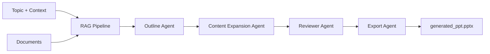

# 🤖 AI PowerPoint Generator - Multi-Agent System

🚀Live Demo: https://ai-ppt-generator-sys.streamlit.app/ 

> Transform your documents into professional PowerPoint presentations using AI-powered multi-agent orchestration, RAG (Retrieval-Augmented Generation), and LangGraph workflows.

## ✨ Features

- 🤖 **Multi-Agent Architecture** - Specialized agents for outline, content expansion, review, and export
- 📚 **RAG Pipeline** - Context-aware content generation from uploaded documents (PDF, DOCX, TXT)
- 🔄 **LangGraph Orchestration** - Structured workflow with state management
- 🌐 **Dual Interface** - Streamlit web UI + FastAPI REST API
- 🎯 **Smart Content Generation** - AI-powered slide creation with citations
- 💾 **FAISS Vector Store** - Efficient document retrieval and semantic search
- 📊 **Professional Output** - Polished PowerPoint presentations ready to use

## 🏗️ Architecture

### Multi-Agent Workflow



### Agent Responsibilities

| Agent                 | Purpose                         | Output                       |
| --------------------- | ------------------------------- | ---------------------------- |
| **Outline Generator** | Creates structured slide layout | Slide titles & bullet points |
| **Content Expander**  | Enriches content using RAG      | Detailed slide content       |
| **Reviewer**          | Validates accuracy & quality    | Quality-checked content      |
| **Exporter**          | Generates PowerPoint file       | `.pptx` file                 |

## 🚀 Quick Start

### Prerequisites

```bash
- Python 3.8+
- OpenAI API Key
- 4GB RAM minimum
```

### Installation

1. **Clone the repository**

```bash
git clone https://github.com/Kushagra3355/contextual_ai_ppt_multiagent_system.git
cd contextual_ai_ppt_multiagent_system
```

2. **Create virtual environment**

```bash
python -m venv venv
# Windows
venv\Scripts\activate
# macOS/Linux
source venv/bin/activate
```

3. **Install dependencies**

```bash
pip install -r requirements.txt
```

4. **Configure environment**

Create `.env` file in project root:

```env
OPENAI_API_KEY=your-openai-api-key-here
MODEL_NAME=gpt-4o-mini
EMBED_MODEL_NAME=text-embedding-3-small
TEMPERATURE=0
DIMENSIONS=512
CHUNK_SIZE=1000
```

## 💻 Usage

### Option 1: Streamlit Web App

Launch the interactive web interface:

```bash
streamlit run streamlit_frontend.py
```

**Access at:** `http://localhost:8501`

#### Features:

- ✅ Drag-and-drop file upload
- ✅ Real-time progress tracking
- ✅ One-click download
- ✅ Responsive UI with tips

### Option 2: FastAPI REST API

Start the API server:

```bash
# Method 1
python api/main.py

# Method 2
uvicorn api.main:app --reload --host 0.0.0.0 --port 8000
```

**Access API:** `http://localhost:8000`

**Interactive Docs:** `http://localhost:8000/docs`

## 📡 API Reference

### Endpoints

| Method   | Endpoint                 | Description           |
| -------- | ------------------------ | --------------------- |
| `GET`    | `/`                      | API information       |
| `POST`   | `/generate`              | Generate presentation |
| `GET`    | `/download/{session_id}` | Download by session   |
| `GET`    | `/download`              | Download latest PPT   |
| `GET`    | `/sessions`              | List active sessions  |
| `DELETE` | `/session/{session_id}`  | Delete session        |
| `GET`    | `/health`                | Health check          |


## 📁 Project Structure

```
contextual_ai_ppt_multiagent_system/
│
├── 📄 streamlit_frontend.py          # Streamlit web application
├── 📄 requirements.txt                # Python dependencies
├── 📄 .env                            # Environment configuration
├── 📄 README.md                       # Documentation
│
├── 📂 api/                            # FastAPI Backend
│   └── main.py                        # Complete API with all endpoints
│
├── 📂 orchestrator/                   # LangGraph Workflow
│   ├── ppt_graph.py                   # Workflow definition
│   └── agent_state.py                 # Shared state schema
│
├── 📂 agents/                         # Specialized Agents
│   ├── __init__.py
│   ├── outline_generator_agent.py     # Slide structure
│   ├── content_expansion_agent.py     # RAG-based expansion
│   ├── reviewer_agent.py              # Quality assurance
│   └── export_agent.py                # PowerPoint export
│
├── 📂 rag_pipeline/                   # RAG Implementation
│   ├── __init__.py
│   ├── pipeline.py                    # RAG orchestration
│   ├── loader.py                      # Document loaders
│   ├── splitter.py                    # Text chunking
│   ├── embedding.py                   # OpenAI embeddings
│   ├── vector_store.py                # FAISS vector DB
│   └── retriever.py                   # Similarity search
│
├── 📂 tools/                          # Helper Tools
│   ├── chart_generator.py             # Chart generation
│   ├── citation_tool.py               # Citation management
│   ├── image_fetcher.py               # Image retrieval
│   └── web_search.py                  # Web search
│
├── 📂 utils/                          # Utilities
│   └── ppt_generator.py               # python-pptx helpers
│
├── 📂 schemas/                        # Data Models
│   ├── ppt_schema.py                  # Presentation models
│   └── slide_schema.py                # Slide models
│
├── 📂 data/                           # Data Storage
│   ├── documents/                     # Reference docs
│   ├── uploads/                       # User uploads (by session)
│   └── draft.txt                      # Content draft
│
├── 📂 vector_db/                      # Vector Database
│   └── index.faiss                    # FAISS index
│
├── 📂 outputs/                        # Generated Files
│   └── generated_ppt.pptx             # Output presentation
│
└── 📂 test/                           # Tests
    ├── __init__.py
    ├── agent_test.py                  # Agent tests
    └── rag_test.py                    # RAG pipeline tests
```

## 🛠️ Technology Stack

| Category                | Technologies                       |
| ----------------------- | ---------------------------------- |
| **AI/ML**               | OpenAI GPT-4, LangChain, LangGraph |
| **Vector DB**           | FAISS                              |
| **Backend**             | FastAPI, Uvicorn                   |
| **Frontend**            | Streamlit                          |
| **Document Processing** | PyPDF2, python-docx, docx2txt      |
| **Presentation**        | python-pptx                        |
| **Data Models**         | Pydantic                           |
| **API Docs**            | Swagger/OpenAPI                    |

## ⚙️ Configuration

### Environment Variables

| Variable           | Description          | Default                  |
| ------------------ | -------------------- | ------------------------ |
| `OPENAI_API_KEY`   | OpenAI API key       | _Required_               |
| `MODEL_NAME`       | GPT model name       | `gpt-4o-mini`            |
| `EMBED_MODEL_NAME` | Embedding model      | `text-embedding-3-small` |
| `TEMPERATURE`      | LLM temperature      | `0`                      |
| `DIMENSIONS`       | Embedding dimensions | `512`                    |
| `CHUNK_SIZE`       | Text chunk size      | `1000`                   |

### RAG Pipeline Tuning

Modify in `rag_pipeline/pipeline.py`:

```python
# Chunk settings
chunk_size = 1000
chunk_overlap = 200

# Retrieval settings
top_k = 5
similarity_threshold = 0.7
```

## 🎨 Customization

### Modify Agent Behavior

Each agent can be customized independently:

**Outline Agent** (`agents/outline_generator_agent.py`):

```python
# Adjust slide count, structure, titles
```

**Content Expander** (`agents/content_expansion_agent.py`):

```python
# Modify RAG retrieval, content depth
```

**Reviewer** (`agents/reviewer_agent.py`):

```python
# Change validation criteria, quality checks
```

**Export Agent** (`agents/export_agent.py`):

```python
# Customize PowerPoint styling, layout
```


## 🐛 Troubleshooting

### Common Issues

**Issue:** `ModuleNotFoundError`

```bash
# Solution: Ensure virtual environment is activated
source venv/bin/activate  # Linux/Mac
venv\Scripts\activate     # Windows
pip install -r requirements.txt
```

**Issue:** `OpenAI API Error`

```bash
# Solution: Check API key in .env file
OPENAI_API_KEY=sk-your-actual-key-here
```

**Issue:** `Port already in use`

```bash
# Solution: Use different port
uvicorn api.main:app --port 8001
streamlit run streamlit_frontend.py --server.port 8502
```

## 📊 Performance

| Metric               | Value         |
| -------------------- | ------------- |
| Avg. Generation Time | 30-60 seconds |
| Supported File Size  | Up to 50MB    |
| Max Slides           | 20            |
| Concurrent Sessions  | 10+           |

## 🗺️ Roadmap

- [x] Multi-agent architecture with LangGraph
- [x] RAG pipeline with FAISS
- [x] Streamlit web interface
- [x] FastAPI REST API (single file, clean implementation)
- [x] Session-based file management
- [x] Document upload & processing
- [x] In-memory session storage
- [ ] Database integration for persistent sessions
- [ ] Template customization (themes, layouts)
- [ ] Image generation for slides
- [ ] Multi-language support
- [ ] Real-time collaboration
- [ ] Cloud deployment (Docker, K8s)
- [ ] Enhanced charts & visualizations
- [ ] Speaker notes generation
- [ ] Batch processing
- [ ] WebSocket for live updates
- [ ] Rate limiting & authentication


## 👤 Author

**Kushagra Omar**

- GitHub: [@Kushagra3355](https://github.com/Kushagra3355)
- Project: [contextual_ai_ppt_multiagent_system](https://github.com/Kushagra3355/contextual_ai_ppt_multiagent_system)

